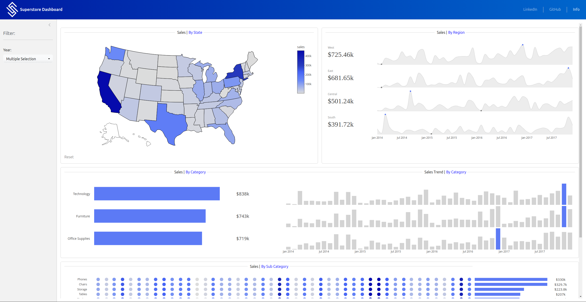

# Superstore Dashboard

This small and simple dashboard was a personal project to apply the knowledge I gained while developing a two-sample t-test app a few years ago.
My main goal was to compare the process of building dashboards in Shiny versus Tableau, which I often use professionally.However, since I wasn’t very 
experienced with the bslib and plotly packages at the time, it took me a while to wrap my head around how everything works.

As I was only aiming to build a basic dashboard in Shiny, this project shouldn’t be seen as a demonstration of my dashboard design skills.
That said, most of my design inspiration comes from Tableau Public. Especially the [Sample Superstore - Sales Performance-Dashboard](https://public.tableau.com/app/profile/pradeepkumar.g/viz/SampleSuperstore-SalesPerformance/viz_)
created by Pradeep Kumar G gave the a little challenge to manage the same results (not exactly) using plotly and bslib. There are perhaps many things that could have been done better, but I'm still gaining experience in this area.

## Description

The following picture shows the overall dashboard. It's pretty straightforward. You can filter the data by selecting a state on the map. To undo your selection, 
simply click the Reset button. On the left-hand side, there’s one additional filter that allows you to choose the desired year. If you want to hide the sidebar, 
you can click the small arrow in the top-right corner of the panel. Of course, all of this sounds quite theoretical — you can either use the code to run the dashboard 
in your own R environment, or simply view the live version I uploaded [here](https://benwort-apps.shinyapps.io/Superstore_Dashboard/).

   

## Getting Started

### Dependencies

If you plan to run it in your own environment, it should work on both Windows 10 and Linux (tested on Mint). You will need at least an R environment.
Besides the operating system, I used the following programs and additional packages:                                                   

* Programs
   - [RStudio (2024.12.1 Build 563)](https://posit.co/download/rstudio-desktop/)
   - [R (4.3.3)](https://posit.co/download/rstudio-desktop/)

* Packages
   - [shiny (1.7.5)](https://cran.r-project.org/web/packages/shiny/index.html)
   - [readxl (1.4.5)](https://cran.r-project.org/web/packages/readxl/index.html)
   - [bslib (0.9.0)](https://cran.r-project.org/web/packages/bslib/index.html)
   - [janitor (2.2.1)](https://cran.r-project.org/web/packages/janitor/index.html)
   - [plotly (4.10.4)](https://cran.r-project.org/web/packages/plotly/index.html)
   - [data.table (1.17.0)](https://cran.r-project.org/web/packages/data.table/index.html)
   - [shinyWidgets (0.7.7)](https://cran.r-project.org/web/packages/shinyWidgets/index.html)
   - [lubridate (1.9.4)](https://cran.r-project.org/web/packages/lubridate/index.html)
   - [readr (2.1.5)](https://cran.r-project.org/web/packages/readr/index.html)

### Installing & Executing 

Just download the R file and run it in a shiny R environment. Nothing more is needed except the programs and 
packages I have given above.

## License

This project is licensed under the MIT License - see the LICENSE.md file for details
